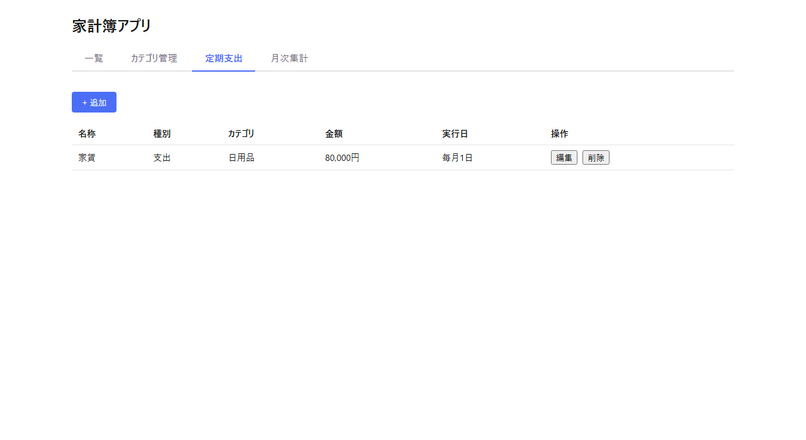

# HOUSEHOLD-BUDGET（家計簿アプリ）

日々の収入・支出を記録し、月別・カテゴリ別に集計できる個人向け家計簿アプリです。

## このプロジェクトについて

以前作成した[Trello風タスク管理アプリ](https://github.com/Mugen0619/TASKMANAGEMENT)と同じ技術スタック（React + Spring Boot + PostgreSQL）でCRUD操作を再度練習しつつ、新たに「月別・カテゴリ別の集計表示」や「定期支出の自動登録」といった、単純なCRUDを超えた画面・API・バッチ処理の設計に挑戦した学習目的の個人プロジェクトです。

要件定義（`docs/requirements.md`）→ 設計（`docs/tech-stack.md` / `docs/data-design.md` / `docs/screen-design.md`）→ 実装、という工程をIssue・ブランチ・Pull Requestに分けて1つずつ進め、開発の全工程をAI（Claude Code）と協働で経験することを重視しました。各工程のドキュメントは以下から参照できます。

- [docs/requirements.md](docs/requirements.md) — 要件定義
- [docs/tech-stack.md](docs/tech-stack.md) — 技術スタック
- [docs/data-design.md](docs/data-design.md) — データ設計・API設計
- [docs/screen-design.md](docs/screen-design.md) — 画面設計

## できること

- 収支記録の作成・一覧表示・編集・削除、期間/種別/カテゴリでの絞り込み・並び替え
- カテゴリの追加・編集・削除（収入用・支出用を独立管理、使用中カテゴリは削除不可）
- 定期支出（家賃・サブスク等）テンプレートの登録による収支記録の自動生成
- 月別・カテゴリ別の集計を表とグラフ（円グラフ）の両方で表示

## スクリーンショット

### 収支記録一覧


定期支出テンプレートから自動生成された記録には「定期」バッジが表示されます。

### カテゴリ管理


### 定期支出テンプレート管理


家賃・サブスクリプション等、毎月同じ内容で発生する収支のテンプレートを登録できます。アプリ起動中に、実行日を過ぎている当月分未生成のテンプレートがあれば自動的に収支記録が生成されます（詳細は [docs/data-design.md 5章](docs/data-design.md#5-定期支出の自動生成バッチ) を参照）。

### 月次集計（表 + 円グラフ）


## 技術スタック

| 区分 | 技術 |
|---|---|
| フロントエンド | React 19.2.8 + TypeScript 5.7.3 + Vite 6.4.3（素のCSS/CSS Modules、ルーティングなし） |
| バックエンド | Spring Boot 4.1.0 + Java 25 + Gradle |
| データベース | PostgreSQL 16（Docker） |
| グラフ | Chart.js + react-chartjs-2 |

全体構成：`[ブラウザ (React)] --HTTP(REST API)--> [Spring Boot] --> [PostgreSQL (Docker)]`

## セットアップ・起動方法

### 前提

- Docker / Docker Compose
- Java 25
- Node.js（npm）

各コンポーネントのポートは固定です。競合する場合はポートを変更せず、使用中のプロセスを停止してから起動し直してください。

| コンポーネント | ポート |
|---|---|
| PostgreSQL | 5432 |
| バックエンド（Spring Boot） | 8080 |
| フロントエンド（Vite） | 5173 |

### 1. PostgreSQLの起動

```bash
docker compose up -d
```

### 2. バックエンドの起動

```bash
cd backend
./gradlew bootRun        # Windowsは ./gradlew.bat bootRun
```

起動後、`http://localhost:8080/api/categories` 等でAPIの疎通を確認できます。初回起動時、`schema.sql`/`data.sql` によりテーブル作成と初期カテゴリ（給与・ボーナス・食費・交通費・日用品）の投入が自動で行われます。

### 3. フロントエンドの起動

```bash
cd frontend
npm install
npm run dev
```

`http://localhost:5173` をブラウザで開いてください。

## テストの実行

```bash
# バックエンド（JUnit 5 + Mockito、結合テストはH2使用）
cd backend
./gradlew test        # Windowsは ./gradlew.bat test

# フロントエンド（Vitest + React Testing Library）
cd frontend
npm run test -- --run
npm run build          # 型チェック込みのビルド確認
```

## 実装状況

要件定義書の機能要件（No.1〜9）に対する実装状況は [docs/requirements.md 5.2章](docs/requirements.md#52-実装状況) を参照してください。

## 工夫した点・学んだこと

- **開発工程をIssue/PR単位で分割**：要件定義→設計→実装を1つの巨大な作業にせず、機能ごと・工程ごとに小さなIssueとPull Requestに分けて進めた。各PRの差分が追いやすく、後から「なぜこの設計にしたか」を要件定義書・設計ドキュメントの更新履歴として遡れる
- **常時起動しないローカル環境を前提としたバッチ設計**：定期支出の自動生成は、一般的な「決まった時刻にcronで実行」ではなく、アプリを手動起動するローカル運用である点を踏まえ、起動中にその都度未生成分をキャッチアップ生成する方式を採用（詳細は[docs/data-design.md 5章](docs/data-design.md#5-定期支出の自動生成バッチ)）。デプロイ環境の制約から実装方式を導く、という経験ができた
- **自動生成データと手入力データの共存設計**：定期支出から自動生成された収支記録も、生成後は通常の収支記録として自由に編集・削除できるようにしつつ、生成元が分かるようにする、というデータモデル上のバランスを検討した
- **テストの網羅範囲を都度チェック**：一度「プロトタイプ完成」とした後も、機能単位でバックエンド（Controller/Service）・フロントエンド（各画面）双方にテストが揃っているか、実際にコマンドを実行して確認する運用にした

## 今後の展望

要件定義書7章で対象外とした機能のうち、特に以下は発展的な学習テーマとして興味がある。

- CSVエクスポート/インポート
- 予算設定・使用率の可視化
- 無料枠を使った公開デプロイ
