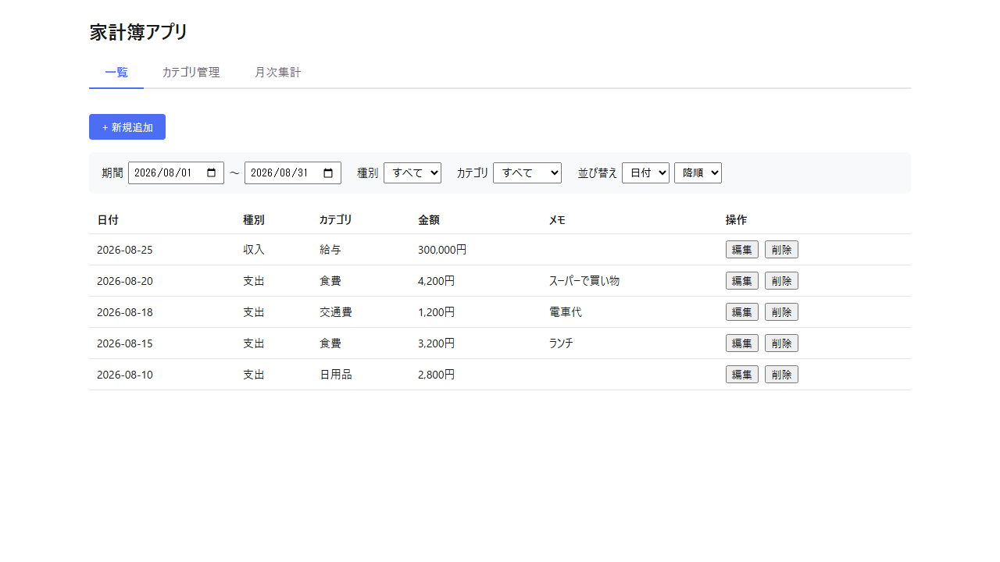
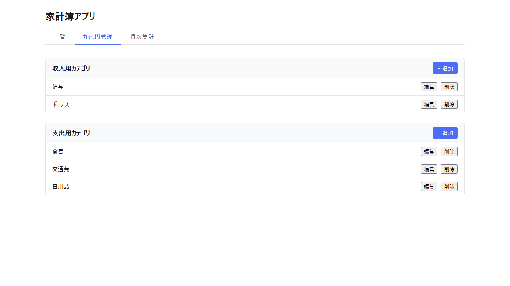
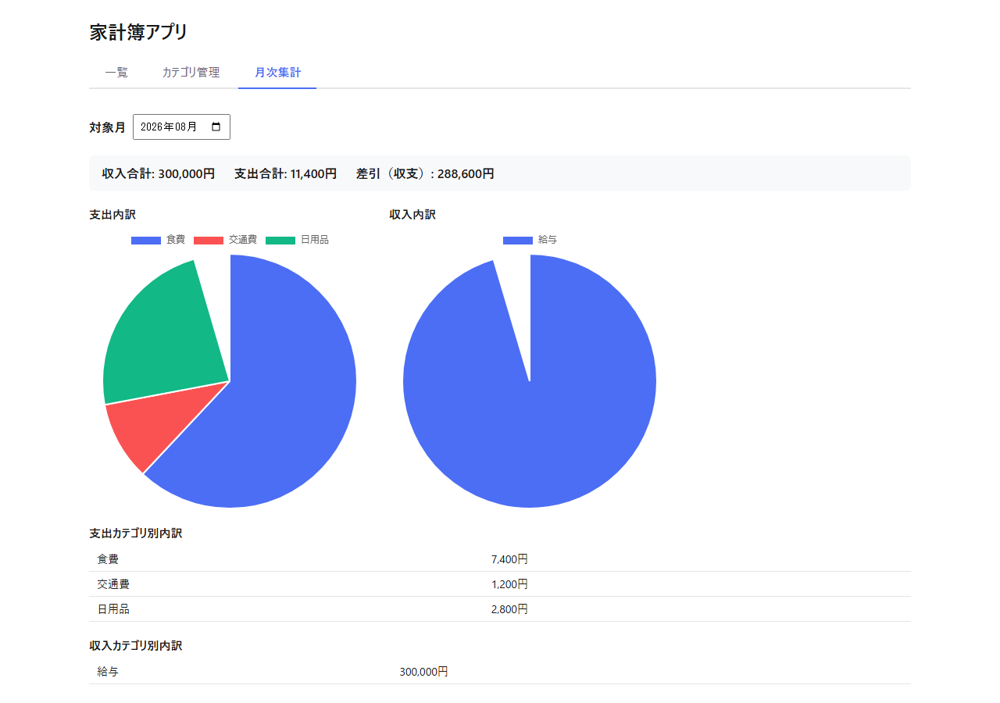

# HOUSEHOLD-BUDGET（家計簿アプリ）

日々の収入・支出を記録し、月別・カテゴリ別に集計できる個人向け家計簿アプリのプロトタイプです。学習目的の個人プロジェクトとして、AI（Claude Code）と協働して開発しています。

詳細な仕様は [docs/requirements.md](docs/requirements.md)（要件定義）、[docs/tech-stack.md](docs/tech-stack.md)（技術スタック）、[docs/data-design.md](docs/data-design.md)（データ設計・API設計）、[docs/screen-design.md](docs/screen-design.md)（画面設計）を参照してください。

## スクリーンショット

### 収支記録一覧


### カテゴリ管理


### 月次集計（表 + 円グラフ）


## 技術スタック

| 区分 | 技術 |
|---|---|
| フロントエンド | React 19.2.8 + TypeScript 5.7.3 + Vite 6.4.3（素のCSS/CSS Modules、ルーティングなし） |
| バックエンド | Spring Boot 4.1.0 + Java 25 + Gradle |
| データベース | PostgreSQL 16（Docker） |
| グラフ | Chart.js + react-chartjs-2 |

全体構成：`[ブラウザ (React)] --HTTP(REST API)--> [Spring Boot] --> [PostgreSQL (Docker)]`

## セットアップ・起動方法

### 前提

- Docker / Docker Compose
- Java 25
- Node.js（npm）

各コンポーネントのポートは固定です。競合する場合はポートを変更せず、使用中のプロセスを停止してから起動し直してください。

| コンポーネント | ポート |
|---|---|
| PostgreSQL | 5432 |
| バックエンド（Spring Boot） | 8080 |
| フロントエンド（Vite） | 5173 |

### 1. PostgreSQLの起動

```bash
docker compose up -d
```

### 2. バックエンドの起動

```bash
cd backend
./gradlew bootRun        # Windowsは ./gradlew.bat bootRun
```

起動後、`http://localhost:8080/api/categories` 等でAPIの疎通を確認できます。初回起動時、`schema.sql`/`data.sql` によりテーブル作成と初期カテゴリ（給与・ボーナス・食費・交通費・日用品）の投入が自動で行われます。

### 3. フロントエンドの起動

```bash
cd frontend
npm install
npm run dev
```

`http://localhost:5173` をブラウザで開いてください。

## テストの実行

```bash
# バックエンド（JUnit 5 + Mockito、結合テストはH2使用）
cd backend
./gradlew test        # Windowsは ./gradlew.bat test

# フロントエンド（Vitest + React Testing Library）
cd frontend
npm run test -- --run
npm run build          # 型チェック込みのビルド確認
```

## 実装状況

要件定義書の機能要件（No.1〜8）に対する実装状況は [docs/requirements.md 5.2章](docs/requirements.md#52-実装状況) を参照してください。
